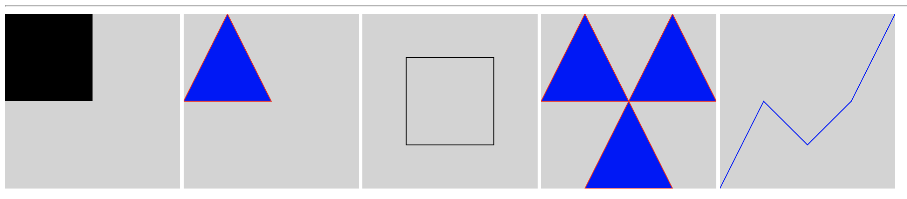
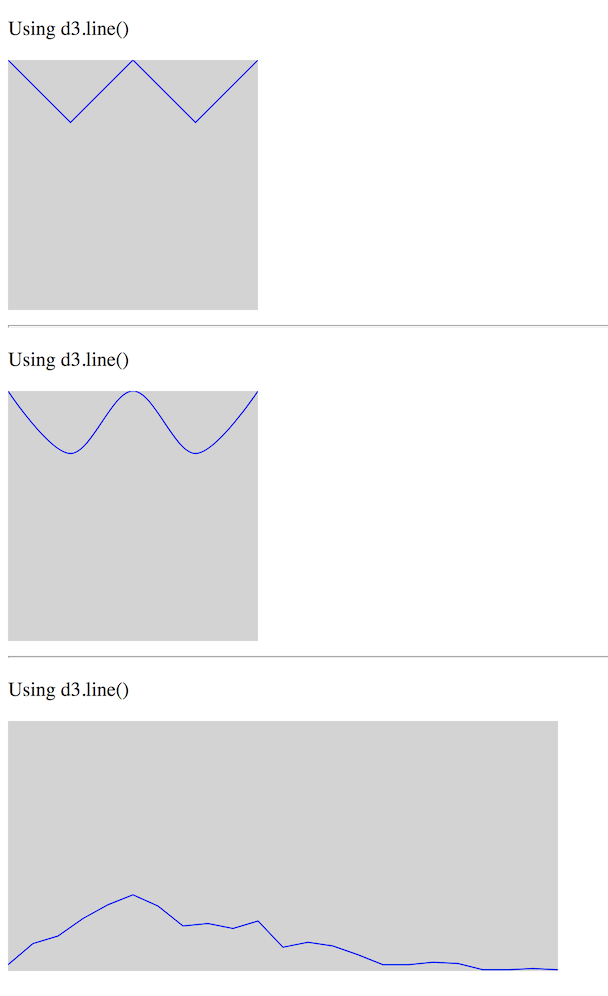

# D3 Exercise 6 – D3 Path & Generators
		
> Complete ALL the exercises in this section. Ask thomas.devine@lyit.ie for help or post an *Issue* on your GitHub repository.

## Fetch latest Repository Branch

```
$ cd /DRIVE/xampp/htdocs/d3
$ git pull --no-edit https://github.com/noucampdotorgSSAD2019/d3.git latest
$ git status

```


## Part 1 - SVG Path Element

1.	Open the code [http://localhost/d3/d3Path.html](http://localhost/d3/d3Path.html) and modify the code to render these using the `<path>` SVG element only:

    


## Part 2 - D3 Line Generator

1.	Open the code [http://localhost/d3/d3lineGenerator.html](http://localhost/d3/d3lineGenerator.html) and modify the code to render these using line generators:

    


## Part 3 - D3 Area Generator

1.	Open the code [http://localhost/d3/d3areaGenerator.html](http://localhost/d3/d3areaGenerator.html) and modify the code to render these using an area generator:

    

1.	Push your code to **your private** repository on GitHub.  Type these commands into your *Git Bash* client:

    ```
    $ git status
    $ git add .
    $ git commit -m "Exercise 6 - DONE|PARTIAL|HELP"
    $ git push origin master
    $ git status

    ```


